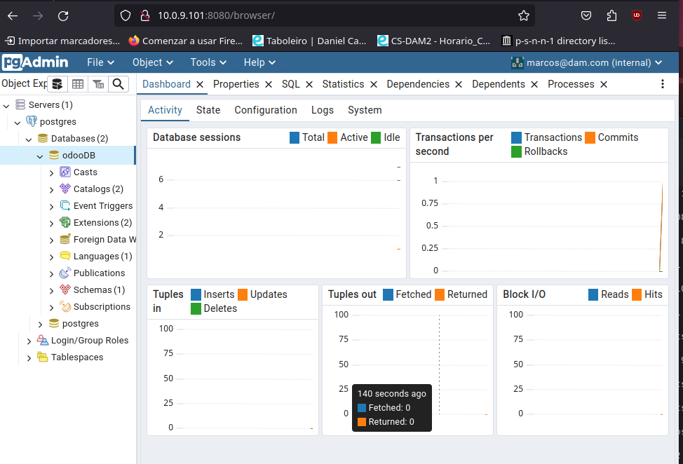

# Instalación de Odoo 17 Community y PgAdmin con Docker Compose

Este repositorio proporciona los archivos necesarios para la instalación de Odoo 17 Community y PgAdmin utilizando Docker Compose. A continuación, se describen las instrucciones paso a paso y los comandos necesarios.

---

## Contenido

- [Requisitos previos](#requisitos-previos)
- [Estructura del proyecto](#estructura-del-proyecto)
- [Explicación del archivo docker-compose.yml](#explicación-del-archivo-docker-composeyml)
- [Instrucciones de instalación](#instrucciones-de-instalación)
- [Comandos útiles](#comandos-útiles)
- [Capturas de pantalla](#capturas-de-pantalla)
- [Preguntas](#preguntas)

---

## Requisitos previos

- Docker y Docker Compose instalados en el sistema.
- Conexión a Internet para descargar las imágenes necesarias.

---

## Estructura del proyecto
```
.
├── docker-compose.yml
└── readme.md
```

---

## Explicación del archivo docker-compose.yml

El archivo `docker-compose.yml` define los servicios necesarios para la instalación:

- **web**: Servicio que ejecuta Odoo 17 Community.
  - Imagen utilizada: `odoo:17.0`
  - Reinicio automático con `restart: always` para asegurar que el contenedor se reinicie si se detiene.
  - `depends_on`: Indica que este servicio depende de la base de datos (`db`).
  - Puertos: Expone el puerto 8069 para acceder a la interfaz de Odoo.
  - Variables de entorno:
    - `HOST`: Define el nombre del servicio de base de datos.
    - `USER` y `PASSWORD`: Credenciales de Odoo.

- **db**: Servicio de base de datos PostgreSQL.
  - Imagen utilizada: `postgres:15`
  - Puertos: Expone el puerto 5432 para acceder a la base de datos.
  - Variables de entorno:
    - `POSTGRES_DB`: Nombre de la base de datos.
    - `POSTGRES_USER` y `POSTGRES_PASSWORD`: Credenciales para la conexión.

- **pgadmin**: Servicio para la interfaz gráfica de administración de PostgreSQL.
  - Imagen utilizada: `dpage/pgadmin4`
  - Reinicio automático con `restart: always`.
  - Puertos: Expone el puerto 8080 (puerto interno 80) para acceso web.
  - Variables de entorno:
    - `PGADMIN_DEFAULT_EMAIL` y `PGADMIN_DEFAULT_PASSWORD`: Credenciales para acceder a PgAdmin.
  - `depends_on`: Indica que este servicio depende del servicio `db`.

---

## Instrucciones de instalación

1. Clona este repositorio:
   ```sh
   git clone https://github.com/mpineirotroncoso/Tarea_10_docker.git
   cd Tarea_10_docker
   ```

2. Lanza los contenedores:
   ```sh
   docker-compose up -d
   ```

3. Verifica que los servicios están corriendo:
   ```sh
   docker ps
   ```

4. Accede a Odoo desde tu navegador:
   - URL: `http://localhost:8069`

5. Accede a PgAdmin:
   - URL: `http://localhost:8080`
   - Configura la conexión a la base de datos usando las credenciales definidas en `docker-compose.yml`.

---

## Comandos útiles

- Detener los contenedores:
  ```sh
  docker-compose down
  ```

- Ver logs de un contenedor:
  ```sh
  docker logs nombre-del-contenedor
  ```

- Reiniciar contenedores:
  ```sh
  docker-compose restart
  ```

---

## Capturas de pantalla

### Odoo


### PgAdmin



---

## Preguntas

### ¿Que ocurre si en el ordenador local el puerto 5432 está ocupado?

Nos dara error porque el puerto ya esta siendo usado, tendriamos que detener el proceso que lo esta usando o cambiar el puerto en el compose

1. Cambiar puerto para la base de datos en `docker-compose.yml`:
   ```yaml
   db:
     ports:
       - "5433:5432"
   ```
2. Usa el puerto 5433 para conectarte desde PgAdmin.

### ¿Y si lo estuviese el 8069? 

Nos dara error porque el puerto ya esta siendo usado, tendriamos que detener el proceso que lo esta usando o cambiar el puerto en el compose

1. Cambiar puerto para Odoo en `docker-compose.yml`:
   ```yaml
   web:
     ports:
       - "8070:8069"
   ```
2. Accede a Odoo usando `http://localhost:8070`.
